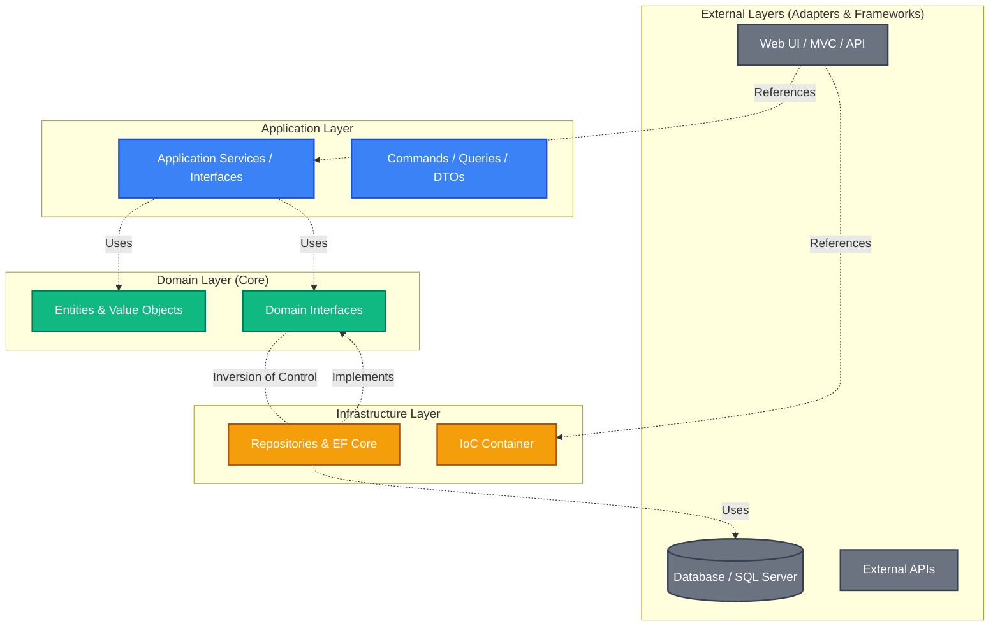

# Clean Architecture com .NET 🚀

Bem-vindo ao repositório **CleanArchMvc**. Este projeto é uma Prova de Conceito (PoC) desenvolvida para demonstrar como construir aplicações .NET altamente escaláveis, testáveis e de fácil manutenção utilizando os princípios da **Clean Architecture** (Arquitetura Limpa).

## 🛑 O Problema (Por que usar essa arquitetura?)

Em sistemas tradicionais (N-Tier), é comum vermos a camada de Negócios depender fortemente da camada de Dados (Banco de dados, ORMs como Entity Framework). 

**O impacto disso em ambientes corporativos reais (Fintechs/Bancos):**
1. **Acoplamento Extremo:** Trocar o banco de dados de SQL Server para MongoDB exige reescrever a regra de negócio.
2. **Testabilidade Nula:** Como a regra de negócio está amarrada ao framework web ou ao banco, escrever testes unitários isolados se torna uma tarefa quase impossível.
3. **Complexidade Evolutiva:** Adicionar uma nova interface (ex: trocar MVC por uma API REST para um app mobile) quebra as validações de negócio.

## 💡 A Solução (Clean Architecture)

Este projeto resolve esses gargalos implementando a **Inversão de Dependência**. A camada central do sistema (`Domain`) não conhece **absolutamente nada** sobre o mundo exterior (não sabe o que é HTTP, não sabe o que é SQL, não sabe o que é JSON).

As dependências fluem de fora para dentro. A camada de `Infrastructure` e `Web` se adaptam ao `Domain`, garantindo que o coração da aplicação permaneça puro, isolado e 100% coberto por testes unitários rápidos.

## 📐 Diagrama de Arquitetura

Aqui está a representação visual das camadas e como as dependências fluem (de fora para o centro):



## 🚀 Como Executar o Projeto Localmente

**Pré-requisitos:**
* [.NET 8 SDK](https://dotnet.microsoft.com/download/dotnet/8.0) instalado.
* Servidor SQL Server rodando (LocalDB, SQL Server Express ou via Docker).
* EF Core CLI (`dotnet tool install --global dotnet-ef`).

**Passo a Passo:**

1. **Clone o repositório:**
```bash
git clone [https://github.com/caique-neves-ferreira/CleanArchMvc.git](https://github.com/caique-neves-ferreira/CleanArchMvc.git)
cd CleanArchMvc

2. Restaure os pacotes e dependências:
Na raiz do projeto, execute:

```bash
dotnet restore

3. Configuração do Banco de Dados:
Navegue até o arquivo appsettings.json dentro do projeto CleanArchMvc.WebUI (ou a camada de API) e certifique-se de que a DefaultConnection aponta para o seu SQL Server local.

```bash
"ConnectionStrings": {
  "DefaultConnection": "Server=(localdb)\\mssqllocaldb;Database=CleanArchDb;Trusted_Connection=True;MultipleActiveResultSets=true"
}

4. Aplique as Migrations (Criação do Banco):
No terminal, execute o comando apontando o projeto de inicialização (Web) e o projeto onde o banco está mapeado (Infra.Data):

```bash
dotnet ef database update -s src/CleanArchMvc.WebUI/ -p src/CleanArchMvc.Infra.Data/

5. Execute a Aplicação:
Navegue até a pasta da interface web/API e inicie o projeto:

```bash
cd src/CleanArchMvc.WebUI
dotnet run


🧪 Como Executar os Testes
A arquitetura foi desenhada para ser altamente testável. Para rodar a suíte de testes unitários que garantem a integridade das regras do Domínio e da Aplicação:

Na raiz do projeto, execute:

```bash
dotnet test


